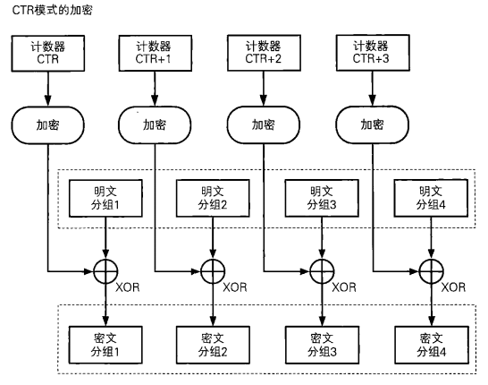
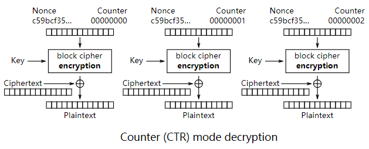

## 1. AES加密算法与分组密码模式

高级加密标准(AES,Advanced Encryption Standard)为最常见的对称加密算法，微信小程序加密传输就是用这个加密算法的。对称加密算法也就是加密和解密用相同的密钥，具体的加密流程如下图：

流密码是对数据流进行连续处理的一类密码算法。流密码一般以1比特、8比特或32比特等为单位进加解密。

**分组密码**是每次只能处理特定长度的一块数据的一类密码算法，这里的“一块”就称为**分组**。一个分组的比特数就称为**分组长度**。

分组密码算法只能加密固定长度的分组，但需要加密的明文长度可能会超过分组密码的分组长度，这就需要对分组密码算法进行迭代，以便将一段很长的明文全部加密。迭代的方法就被称为**分组密码的模式**，分组密码的主要模式有以下5种：

- ECB模式：Electronic CodeBook mode（电子密码本模式）
- CBC模式：Cipher Block Chaining mode（密码分组链接模式）
- CFB模式：Cipher FeedBack mode（密文反馈模式）
- OFB模式：Output FeedBack mode（输出反馈模式）
- CTR模式：CounTeR mode（计数器模式）

## 2. ECB模式

在ECB模式中，将明文分组加密之后的结果将直接成为密文分组。

ECB模式中，明文分组和密文分组是一一对应的关系，因此，如果明文中存在多个相同的明文分组，则这些明文分组最终将被转换为相同的密文分组。所以这种模式安全性低，易攻击。

## 3. CBC模式

CBC模式的密文分组像链条一样相互连接在一起，加密过程如图所示：

因为在CBC加密的过程中，上一个加密结果是与下一个明文块进行异或运算，这样做的目的就是为了扰乱明文和加密结果之间的统计概率。第一个明文块是没有上一个密文干扰的，所以就引入初始化向量IV(Initialization Vector)这个加密参数，这个IV的作用就是作为种子为第一个明文块进行干扰的。

那么IV是否需要是一个常量呢？假设IV固定，那么干扰之后出现的结果也是固定的，并不能起到打乱统计概率的目的，因此**明确要求这个IV是随机的**。

## 4. CFB模式

在CFB模式中，前一个密文分组会被送回到密码算法的输入端。所谓反馈，这里指的就是返回输入端的意思。

在ECB模式和CBC模式中，明文分组都是通过密码算法进行加密的，但在CFB模式中，明文分组并没有通过密码算法来直接进行加密。在CFB模式中，明文分组和密文分组之间只有一个XOR。

同样地，在生成第一个密文分组时，由于不存在前一个输出的数据，因此需要使用**初始化向量**（**IV**）来代替(与CBC模式相同)。

## 5. OFB模式

在OFB模式中，密码算法的输出会反馈到密码算法的输入中。OFB模式并不是通过密码算法对明文直接进行加密的，而是通过将“明文分组”和“密码算法的输出”进行XOR来产生“密文分组”的，这点与CFB模式相似。

OFB模式和CFB模式的区别仅仅在于密码算法的输入。
CFB模式中，密码算法的输入是前一个密文分组，也就是将密文分组反馈到密码算法中，因此被称为“密文反馈模式”；
OFB模式中，密码算法的输入是密码算法的前一个输出，也就是将输出反馈给密码算法，因此被称为“输出反馈模式”。

## 6. CTR模式

CTR模式是一种通过将逐次累加的计数器进行加密来生成密钥流的流密码。最终的密文分组是通过将计数器加密的到的比特序列，与明文分组进行XOR而得到的。

在CTR模式下，将之前提到的IV分成两部分，高位部分是一个随机数(Nonce)，低位部分是一个计数器。在加密过程中，每加密一个分组后，计数器的值自增。由于计数器的值每次都不同，所以每个分组中将计数器的值加密所得到的密钥流也是不同的。换言之，这种方法就是用分组密码来模拟生成随机序列。

**OFB模式与CTR模式的对比:**

1. 两者都是流密码。
2. OFB模式是将加密的输出反馈到输入，CTR模式是将计数器的值用作输入。

**CTR模式的特点:**

1. CTR加密后解密可以使用完全相同的结构；
2. 可以以任意顺序对分组进行加解密，实现并行计算，所以在支持并行计算的系统中，CTR模式速度非常快。

## 7. 分组模式密码比较表

| 模式    | 名称                                           | 优点                                                         | 缺点                                                         | 备注                             |
| ------- | ---------------------------------------------- | ------------------------------------------------------------ | ------------------------------------------------------------ | -------------------------------- |
| ECB模式 | Electronic CodeBook mode（电子密码本模式）     | 简单、快速、支持并行运算（加密、解密）                       | 明文中的重复排列会反映在密文中；通过删除、替换密文分组可以对明文进行操作；对包含某些比特错误的密文进行解密时，对应的分组会出错；不能低于重放攻击。 | 不应使用                         |
| CBC模式 | Cipher Block Chaining mode（密码分组链接模式） | 明文的重复排列不会反映在密文中；支持并行计算（仅解密）；能够解密任何密文分组 | 对包含某些错误比特的密文进行解密时，第一个分组的全部比特以及后一个分组的相应比特会出错；加密不支持并行计算 | CRYPTREC推荐；《实用密码学》推荐 |
| CFB模式 | Cipher FeedBack mode（密文反馈模式）           | 不需要填充（padding）；支持并行计算（仅解密）；能够解密任意密文分组 | 加密不支持并行计算；对包含某些错误比特的密文进行解密时，第一个分组的全部比特以及后一个分组的相应比特会出错；不能低于重放攻击 | CRYPTREC推荐                     |
| OFB模式 | Output FeedBack mode（输出反馈模式）           | 不需要填充（padding）；可实现进行加密、解密的准备；解密解密使用相同结构；对包含某些错误比特密文解密时，只有明文中相应的比特会出错 | 不支持并行计算；主动攻击者反转密文分组中的某些比特时，明文分组中相应的比特也会被反转 | CRYPTREC推荐                     |
| CTR模式 | CounTeR mode（计数器模式）                     | 不需要填充（padding）；可实现进行加密、解密的准备；解密解密使用相同结构；对包含某些错误比特密文解密时，只有明文中相应的比特会出错；支持并行计算（加密、解密) | 主动攻击者反转密文分组中的某些比特时，明文分组中相应的比特也会被反转 | CRYPTREC推荐；《实用密码学》推荐 |

## 8. AES算法GCM模式

在上面的几种工作模式中，ECB、CFB、OFB 三种模式可以解决 ECB 模式中相同明文生成相同密文的缺陷，CTR 又可以在此基础上提供多分组并行加密特性，但是它们都不能提供密文消息完整性校验功能，所有就有了 GCM 模式。

### MAC

MAC 全称是 Message Authentication Code，中文名称为消息认证码，一串由密钥和密文生成的固定值，有时也称 Auth Tag。使用流程如下：

- 首先 Sender 和 Receiver 共享同一个 Key，约定一个 MAC 计算算法 Algorithm；
- Sender 把要传递的消息 Message 通过 Key 和 Algorithm 计算出 $ MAC $，将 Message 和 $MAC$ 发送给 Receiver；
- Receiver 收到 Message 和 $MAC$ 后，将 Message 通过约定的 Key 和算法 Algorithm 计算出 $MAC_1$，通过对比 $MAC$ 和 $MAC_1$ 是否相等
  - $MAC = MAC_1$ 消息无篡改且是 Sender 发布的
  - $MAC \neq MAC_1$ 消息有篡改或者根本不是 Sender 发布的，也就是有问题

### GMAC

GMAC 全称是 Galois Message Authentication Code，中文名称为伽罗瓦消息验证码。GMAC 就是利用伽罗华域（Galois Field，GF，有限域）乘法运算来计算消息的 MAC 值。

### GCM模式

GCM 全称为 Galois/Counter Mode，可以看出 G 是指 GMAC，C 是指 CTR。它在 CTR 加密的基础上增加 GMAC 的特性，解决了 CTR 不能对加密消息进行完整性校验的问题。

GCM 加密所需数据：明文 P、加密密钥 Key、初始向量 IV、附加消息 F。

1. 将 P 分为 P1、P2、…、Pn，Px 长度 <= 128
2. 生成累加计数器 c0、c1、c2、…、cn，由密钥 Key 计算出密钥 H
3. 将 IV、c0 进行运算（连接、加和、异或等）得到 IV_c0，用 Key 加密 IV_c0 得到 IVC0
4. 将 IV、c1 进行运算（连接、加和、异或等）得到 IV_c1，用 Key 加密 IV_c1 得到 IVC1，将 IVC1、P1 做异或运算得到 C1，用密钥 H 通过 GMAC 算法将附加消息 F 计算出 F1， F1 与 C1 做异或运算得到 FC1